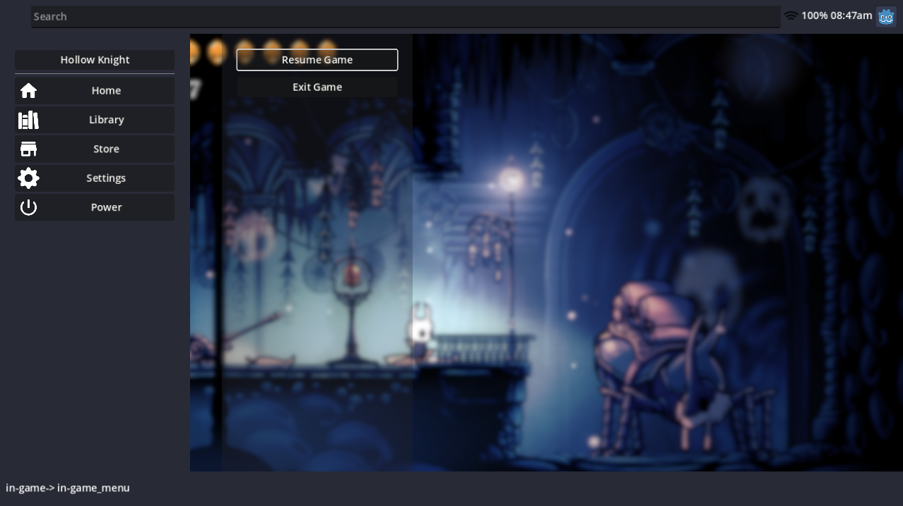
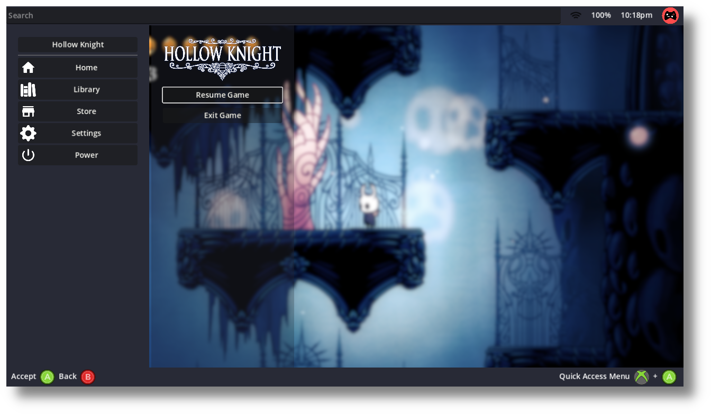
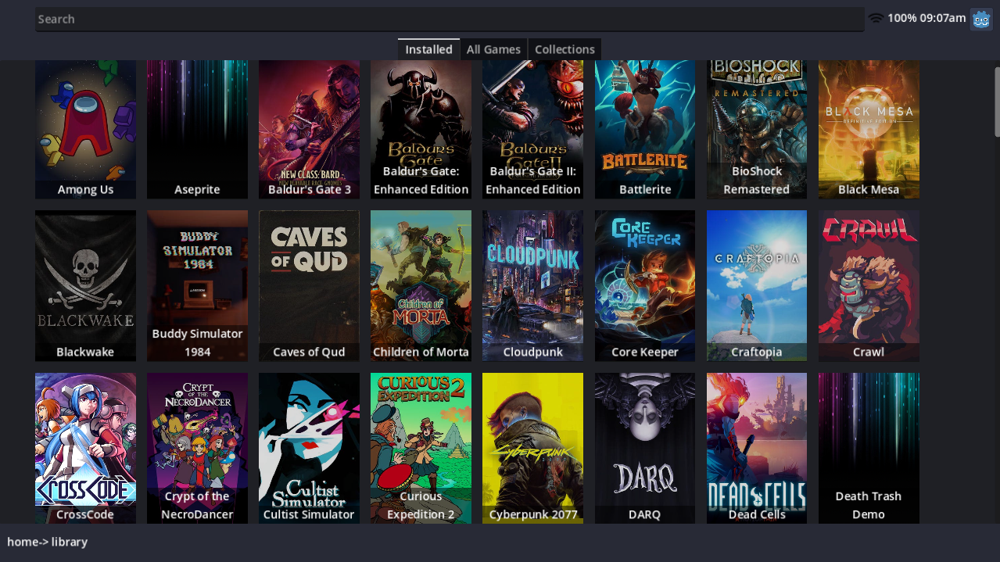

# Open Gamepad UI

Open Gamepad UI is a free and open source game launcher and overlay written using the
[Godot Game Engine 4](https://godotengine.org/) designed with a gamepad native
experience in mind. Its goal is to provide an open and extendable foundation
to launch and play games.

> :warning: NOTE: This project is currently in the very early stages of development.







## Documentation

You can read documentation about how to use and develop for the project here:

- [User Guide](./docs/USER.md)
- [Developer Guide](./docs/DEVELOPER.md)
- [Plugin Guide](./docs/PLUGINS.md)

## Requirements

### Runtime Requirements

The following are required to run Open Gamepad UI:

- gamescope
- gcc-libs
- glibc
- libx11
- libxau
- libxcb
- libxdmcp
- libxext
- libxres
- ryzenadj (optional)
- mangoapp (optional)

## Usage

OpenGamepadUI is still in the early stages of development, so expect to
encounter many bugs. Knowing this, if you still want to try, use the following
steps below to run OpenGamepadUI:

- Download the latest version of OpenGamepadUI from the [releases](https://github.com/ShadowBlip/OpenGamepadUI/releases) page.

- Extract the archive to a folder

```bash
tar xvfz opengamepadui.tar.gz
```

- Run OpenGamepadUI in Gamescope

```bash
gamescope -w 1920 -h 1080 -f -e --xwayland-count 2 -- ./opengamepadui/opengamepad-ui.x86_64
```
