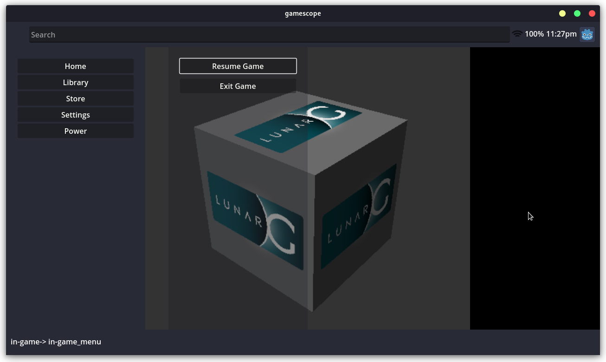

# Open Gamepad UI

Open Gamepad UI is a free and open source game launcher written using the
[Godot Game Engine 4](https://godotengine.org/) designed with a gamepad native
experience in mind. Its goal is to provide an open and extendable foundation
to launch and play games.

> :warning: NOTE: This project is currently in the very early stages of development.



## Requirements

### Build Requirements

The following are required to build Open Gamepad UI:

- Godot 4.x
- GCC 7+ or Clang 6+.
- Python 3.5+.
- SCons 3.0+ build system
- pkg-config (used to detect the dependencies below).
- X11, Xcursor, Xinerama, Xi and XRandR development libraries.
- MesaGL development libraries.
- ALSA development libraries.
- PulseAudio development libraries.
- make (optional)
- unzip (optional)
- wget (optional)

If you are using ArchLinux, you can run the following:

```bash
pacman -S --needed scons pkgconf gcc libxcursor libxinerama libxi libxrandr mesa glu libglvnd alsa-lib pulseaudio make unzip wget git
```

### Runtime Requirements

The following are required to run Open Gamepad UI:

- gamescope

## Building

You can build Open Gamepad UI using the following:

```bash
make build
```

Godot imports and converts assets when it builds. If you see
errors related to failing to load resources. Try running:

```bash
make import
```

## Usage

Open Gamepad UI works in conjunction with [gamescope](https://github.com/Plagman/gamescope/)
to manage launching games in a seamless way.

To run Open Gamepad UI, run the following to launch through gamescope:

```bash
make run
```
