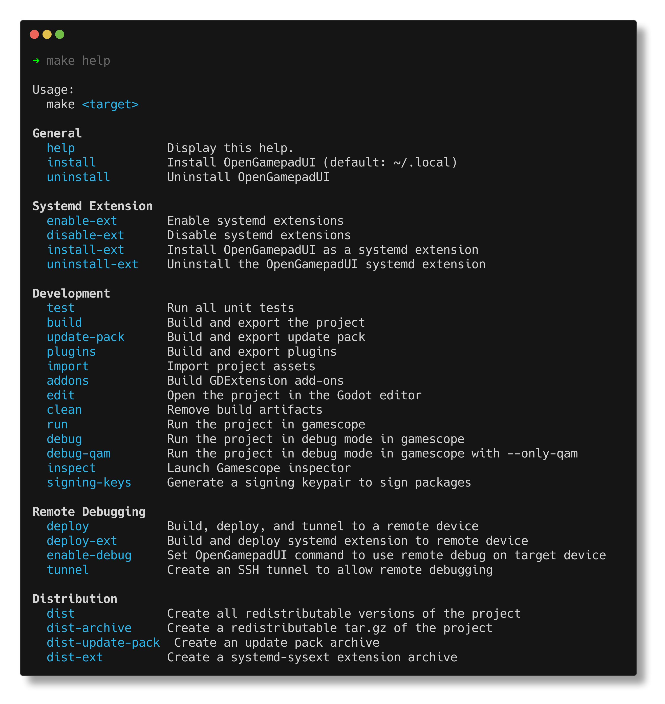

# Developer Guide

This guide explains how to contribute to OpenGamepadUI core codebase. It
has information about best practices, code style, and the internal structure of
the codebase.

## Contributing

OpenGamepadUI is a free and open source project. Its contributors develop it
pro bono in their free time out of personal interest.

Before working on a feature or bug, be sure to look for the issue in the
[issue tracker](https://github.com/ShadowBlip/OpenGamepadUI/issues)
to see if the issue is already being tracked or worked on by another member
of the community. If not, open a new issue describing the bug or feature. It's
important to discuss bugs and features with other contributors.

## Best practices

### #1 Always start with an issue

Coordinating an open source project is hard. One of the most important steps to
contributing is opening an issue describing the bug or feature you want to work
on, and discussing if/how the problem should be resolved or implemented.
Maintaining a large code base is difficult and implementation and coordination
is key.

### #2 Prefer small scope pull requests

Pull requests should try to be small in scope and only address one relevant
feature or bug. Try not to include unrelated fixes or features in the same
pull request. Open a separate one for each issue you address.

### #3 Prefer standalone, composable, decoupled solutions

When contributing code for bugs or features, try to ensure that your solution
is as independent and decoupled from other systems as possible. This usually
means taking advantage of Godot's [signals](https://docs.godotengine.org/en/latest/getting_started/step_by_step/signals.html)
feature, [node groups](https://docs.godotengine.org/en/latest/tutorials/scripting/groups.html),
and [resources](https://docs.godotengine.org/en/latest/tutorials/scripting/resources.html).
Your solution should be able to run independently, even if other systems you
rely on might not be available.

### #4 Prefer solutions without external dependencies

OpenGamepadUI aims to be portable and not rely on system-installed dependencies.
In some cases not every problem has a simple solution, so sometimes the right
choice is to rely on a third-party dependency, but try to create a self-contained
solution, if possible.

## Before you start

OpenGamepadUI is written using the [Godot Game Engine 4](https://godotengine.org/).
If you don't have any experience with the Godot engine, it might be best to try
completing a tutorial or two to get familiar with how the engine, and its
scripting language GDScript, works.

There are some great tutorials here to get started:

- https://docs.godotengine.org/en/latest/getting_started/first_2d_game/index.html
- https://docs.godotengine.org/en/latest/community/tutorials.html
- https://docs.godotengine.org/en/latest/tutorials/scripting/gdscript/index.html

OpenGamepadUI is primarily written in GDScript and some C++, but parts of the project
could potentially be written using other languages using GDExtension, if
required.

## Building from source

### Getting the source

Before building OpenGamepadUI, you first need to actually download the source
code using `git`. Ensure you have `git` installed, and run the following to
clone the project locally:

```bash
git clone https://github.com/ShadowBlip/OpenGamepadUI.git
```

### Build Requirements

The following are required to build Open Gamepad UI:

- Godot 4.x
- GCC 7+ or Clang 6+.
- Python 3.5+.
- SCons 3.0+ build system
- pkg-config (used to detect the dependencies below).
- X11, Xcursor, Xinerama, Xi and XRandR development libraries.
- MesaGL development libraries.
- ALSA development libraries.
- PulseAudio development libraries.
- Evdev development libraries
- make (optional)
- unzip (optional)
- wget (optional)

If you are using ArchLinux, you can run the following:

```bash
pacman -S --needed scons pkgconf gcc gcc-libs libxcursor libxinerama libxi libxrandr mesa glu libglvnd alsa-lib make cmake unzip wget git libevdev libxau libxcb libxdmcp libxext libxres libxtst squashfs-tools godot
```

### Building

OpenGamepadUI uses `make` to help make developing the project easier. You can
view the things you can do with `make` by running `make help`:



You can build the OpenGamepadUI binary using the following:

```bash
make build
```

Godot imports and converts assets when it builds. If you see
errors related to failing to load resources. Try running:

```bash
make import
```

### Usage

Open Gamepad UI works in conjunction with [gamescope](https://github.com/Plagman/gamescope/)
to manage launching games in a seamless way.

To run OpenGamepadUI, run the following to launch through gamescope:

```bash
make run
```

You can also run OpenGamepadUI in gamescope in debug mode with the Godot editor
open with:

```bash
make debug
```

## Code Style Guidelines

In general, OpenGamepadUI tries to conform to using the official GDScript
style guide from Godot:

https://docs.godotengine.org/en/latest/tutorials/scripting/gdscript/gdscript_styleguide.html

Some additional guidelines to try and follow are:

- Always use type annotations. Knowing our types is half the battle

Good

```gdscript
func do_something(button: Button) -> void:
	var button_name := button.name
```

Bad

```gdscript
func do_something(button):
	var button_name = button.name
```

## Core systems & architecture

This section describes the organization of OpenGamepadUI's source code, and
provides an overview of the architecture and systems that it uses.

### Global Systems

OpenGamepadUI has several global systems that are typically implemented as
a [custom resource](https://docs.godotengine.org/en/latest/tutorials/scripting/resources.html#creating-your-own-resources).
Resources in Godot are unique in that they are only ever loaded once by the
engine. This allows nodes to access their functionality regardless of where
they are in the scene tree. This section describes some of those systems and
what they do.

#### BoxArtManager

The [BoxArtManager](https://github.com/ShadowBlip/OpenGamepadUI/blob/main/core/global/boxart_manager.gd)
is responsible for managing any number of [BoxArtProviders](https://github.com/ShadowBlip/OpenGamepadUI/blob/main/core/systems/boxart/boxart_provider.gd)
and providing a unified way to provide box art from multiple sources to any
systems that might need them. New box art sources can be created in the core
code base or in plugins by implementing/extending the
[BoxArtProvider](https://github.com/ShadowBlip/OpenGamepadUI/blob/main/core/systems/boxart/boxart_provider.gd)
class and registering the provider with the box art manager.

With registered box art providers, other systems can request box art from the
BoxArtManager, and it will use all available sources to return the best artwork:

```gdscript
const BoxArtManager := preload("res://core/global/boxart_manager.tres")
...
var boxart := BoxArtManager.get_boxart(library_item, BoxArtProvider.LAYOUT.LOGO)
```

#### Gamescope

The [Gamescope](https://github.com/ShadowBlip/OpenGamepadUI/blob/main/core/systems/gamescope.gd)
class is responsible for interacting with Gamescope, usually via the means of
setting gamescope-specific window properties. It can be used to discover
Gamescope displays, list windows and their children, and set gamescope-specific
window atoms to switch windows, set blur, limit FPS, etc.

For example, to limit the FPS, you can do the following:

```gdscript
Gamescope.set_fps_limit(display, 30)
```

Most of the core functionality of this class is provided by the
[godot-xlib](https://github.com/ShadowBlip/OpenGamepadUI/tree/main/addons/godot-xlib)
module, which is a [GDExtension](https://docs.godotengine.org/en/latest/getting_started/step_by_step/scripting_languages.html#c-and-c-via-gdextension)
that exposes Xlib methods to Godot.

#### InputManager

The [InputManager](https://github.com/ShadowBlip/OpenGamepadUI/blob/main/core/global/input_manager.gd)
class is responsible for handling global input that should happen everywhere in
the application. The input manager discovers gamepads and interepts their input
so OpenGamepadUI can control what inputs should get passed on to the game and
what only OpenGamepadUI should process. This works by grabbing exclusive access
to the physical gamepads and creating a virtual gamepad that games can see.

It is also responsible for setting some Gamescope atoms to redirect input focus
to either a running game or the OpenGamepadUI overlay.

#### LaunchManager

The [LaunchManager](https://github.com/ShadowBlip/OpenGamepadUI/blob/main/core/global/launch_manager.gd)
class is responsible starting and managing the lifecycle of games and is one
of the most complex systems in OpenGamepadUI. Using gamescope, it manages
what games start, if their process is still running, and fascilitates window
switching between games. It also provides a mechanism to kill running games and
discover child processes. It uses a timer to periodically check on launched
games to see if they have exited, or are opening new windows that might need
attention.

Example:

```gdscript
const LaunchManager := preload("res://core/global/launch_manager.tres")
...
# Create a LibraryLaunchItem to run something
var item := LibraryLaunchItem.new()
item.command = "vkcube"

# Launch the app with LaunchManager
var running_app := LaunchManager.launch(item)

# Get a list of running apps
var running := LaunchManager.get_running()
print(running)

# Stop an app with LaunchManager
LaunchManager.stop(running_app)
```

#### LibraryManager

The [LibraryManager](https://github.com/ShadowBlip/OpenGamepadUI/blob/main/core/global/library_manager.gd)
is responsible for managing any number of [Library](https://github.com/ShadowBlip/OpenGamepadUI/blob/main/core/systems/library/library.gd)
providers and offers a unified interface to manage games from multiple sources.
New game library sources can be created in the core code base or in plugins by
implementing/extending the
[Library](https://github.com/ShadowBlip/OpenGamepadUI/blob/main/core/systems/library/library.gd)
class and registering the provider with the library manager.

With registered library providers, other systems can request library items from the
LibraryManager, and it will use all available sources to return a unified library
item:

```gdscript
const LibraryManager := preload("res://core/global/library_manager.tres")
...
# Return a dictionary of all installed games from every library provider
var installed_games := LibraryManager.get_installed()
```

Games in the LibraryManager are stored as [LibraryItems](https://github.com/ShadowBlip/OpenGamepadUI/blob/main/core/systems/library/library_item.gd),
which contains information about each game. Each `LibraryItem` has a list of
[LibraryLaunchItems](https://github.com/ShadowBlip/OpenGamepadUI/blob/main/core/systems/library/library_launch_item.gd)
which contains the data for how to launch that game through a specific `Library`
provider.

```gdscript
# Get a LibraryItem by name
var library_item := LibraryManager.get_app_by_name("Hollow Knight")

# List all of the ways to launch the game through different library providers
for launch_item in library_item.launch_items:
	print(launch_item._provider_id)
	print(launch_item.command, launch_item.args)
```

#### NotificationManager

The [NotificationManager](https://github.com/ShadowBlip/OpenGamepadUI/blob/main/core/global/notification_manager.gd)
is responsible for providing an API to display arbitrary notifications
to the user and maintain a history of those notifications. It also manages
a queue of notifications so only one notification shows at a time.

Notifications can be sent with:

```gdscript
const NotificationManager := preload("res://core/global/notification_manager.tres")
...
var notify := Notification.new("Hello world!")
notify.icon = load("res://assets/icons/critical.png")
NotificationManager.show(notify)
```

#### PluginLoader

The [PluginLoader](https://github.com/ShadowBlip/OpenGamepadUI/blob/main/core/global/plugin_loader.gd)
is responsible for downloading, loading, and initializing OpenGamepadUI plugins.
The plugin system for OpenGamepadUI is heavily based upon the modding system
implemented by [Delta-V](https://gitlab.com/Delta-V-Modding/Mods/-/blob/main/game/ModLoader.gd).

The PluginLoader works by taking advantage of Godot's
[ProjectSettings.load_resource_pack()](https://docs.godotengine.org/en/latest/classes/class_projectsettings.html#class-projectsettings-method-load-resource-pack)
method, which can allow us to load Godot scripts and scenes from a zip file.
The PluginLoader looks for zip files in `user://plugins`, and parses the
`plugin.json` file contained within them. If the plugin metadata is valid, the
loader loads the zip as a resource pack.

#### SettingsManager

The [SettingsManager](https://github.com/ShadowBlip/OpenGamepadUI/blob/main/core/global/settings_manager.gd)
is a simple class responsible for getting and setting user-specific settings.
These settings are stored in a single file at `user://settings.cfg`. User
customizable settings can be used with:

```gdscript
const SettingsManager := preload("res://core/global/settings_manager.tres")
...
# Get a value from the settings file
var value := SettingsManager.get_value("general.home", "max_home_items")

# Set a value in the settings file
SettingsManager.set_value("general.home", "max_home_items", 6)
```

## Writing decoupled code in Godot

Writing and maintaining large, complicated code bases is a big challenge.
One of the ways to combat this complexity is to try and write systems that are
modular and composable, with few or no hard dependencies on other systems.
Godot provides several patterns we can use to help make our code simple and
independent. This usually means taking advantage of Godot's
[signals](https://docs.godotengine.org/en/latest/getting_started/step_by_step/signals.html)
feature, [node groups](https://docs.godotengine.org/en/latest/tutorials/scripting/groups.html),
and [resources](https://docs.godotengine.org/en/latest/tutorials/scripting/resources.html).

Some of the ideas below are largely taken from a great
[post](https://www.reddit.com/r/godot/comments/vodp2a/comment/iegv4fs/?utm_source=share&utm_medium=web2x&context=3)
about how to accomplish this in Godot, but modified with OpenGamepadUI in mind.

Strictly speaking, the idea is to make your scenes behave like nodes. Nodes can
be instanced anywhere in the scene tree and don't care what their parents or
siblings are. Their behavior is encapsulated by the set of methods, properties,
and signals they expose. Consider this mantra:

    Every branch of your scene tree should function independently of its parents.

In other words, if you right click on any node and choose "save branch to scene",
you should be able to run that scene on its own without getting any errors.
Now, it may not actually do anything substantial, since nothing is controlling
it or listening to its signals, but it shouldn't throw any errors or require any
particular type of parent in order to function properly.

That brings us to the point: what options do you have for preserving branch
independence?

### Export a NodePath

This is admittedly really close to breaking the rules, but it sometimes makes
sense to let your user tell the child node where to find a loose dependency.
The builtin nodes use this trick all over the place. The `AnimationPlayer` and
`AnimationTree` are a good example. The key here is to have your script
"fail safe" and check if the nodepath is unset before trying to do anything
with it.

This approach works best if...

- The external node can be any instance of a builtin class (e.g. any
  `AnimationPlayer`). This isn't a hard requirement, but for scenes and custom
  classes it can become difficult to tell if the user-provided dependent node
  is valid.

- The external node is likely to be in the same scene. You can't set node paths
  in the editor across scenes, and even setting them programmatically with
  scripts can be tricky. If you need this, see the next option.

- The external node's state is largely irrelevant to the functioning of your
  node and its children. In other words, your node should be able to do
  everything it needs to do with its own state, but perhaps it calls methods on
  the external node as a side effect. For example, you might have one node
  that plays different animations if you provide it with an `AnimationPlayer`
  node. If you don't give it an animation player, all the node's state change
  stuff will work, it will just skip over the animation stuff.

### Use a (custom) resource

The key here is leveraging the fact that resource instances are globally unique.
So if you need a bunch of nodes to share data, without being bound to a strict
hierarchy, this is a great option. Let's say you have a UI scene that wants to
show what the state is of another menu, but god knows where in the scene tree
that menu is in relation to each other.

With the resource approach, you just give the UI scene and the menu scene access
to the same MenuState resource. This resource should fire signals whenever its
various properties are changed. Both the UI and menu scenes then connect to
whichever signals are relevant to them. So, in this instance, the UI scene might have
a bunch of text labels hooked up to every property of the MenuState, and the
menu scene might hook the signal for "menu changed" up to a method that fires
an animation or something.

Use this approach if...

- The dependency involves some kind of shared state, rather than one node
  directly controlling another.

- The dependency isn't a node.

- You want to propagate a bunch of shared state information through a scene tree
  (think: the `Style` resources that UI controls use). This will involve some
  boilerplate, but it usually scales better because child nodes can control
  themselves based on the resource state instead of bloating the parent with a
  bunch of code that just sets properties on the children.

### Use an autoload (or another kind of global)

This option you may already know, and has benefits and drawbacks. 90% of the
time when you want to use autoloads, you probably want to use a resource
instead. However, there are situations where an autoload makes sense.

Use this approach only if...

- You need a node, but the requirements for the export nodepath approach aren't
  satisfied. To be clear: you only need a node if you are going to write a
  process function. If you just need a data container, or a place to put global
  signals, use a resource instead. If you need globally accessible helper
  methods, use static functions in a script (if you define a `class_name` in
  the script the UX is identical to autoloads).

- This node is unique.

- You keep the behavior and state encapsulated by this node to a minimum (one
  approach involves having an autoload that effectively just contains references
  to other resources and nodes).
