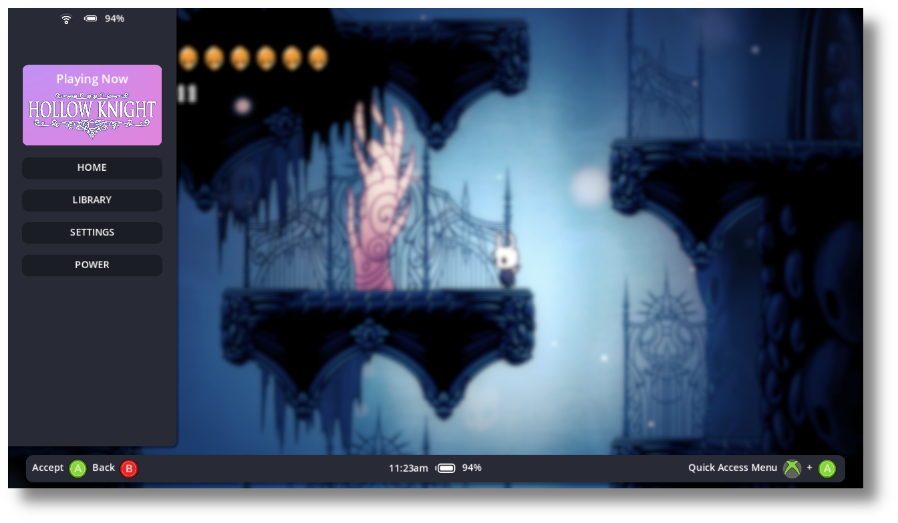
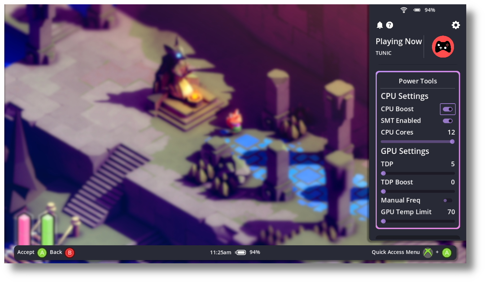

---
hide:
  - toc
  - navigation
---

<h1 align="center">
  
   
  Open Gamepad UI
</h1>

  
  
  
  
   
   

## :octicons-info-24: What is OpenGamepadUI?

Open Gamepad UI is a free and open source game launcher and overlay written 
using the Godot Game Engine 4 designed with a gamepad native experience in mind. 
Its goal is to provide an open and extendable foundation to launch and play 
games. It also implements a gamepad input system that can allow you to remap 
gamepad input to mouse and keyboard inputs.

## :octicons-light-bulb-24: Features 

- In-game overlay menus
- Power tools (TDP control, SMT, etc.)
- Fully configurable gamepad input (buttons, axes, mouse & keyboard, etc.)
- Per-game customizable gamepad profiles
- Launch games from multiple sources
- Automatic artwork downloading
- Plugin architecture

## :octicons-image-24: How does it work and look?

OpenGamepadUI works hand-in-hand with Gamescope, which is a Wayland compositor
designed for a console-like experience.

Some examples of what it looks like are here:

  
  

    
    
    
  

## :octicons-book-24: Organization of the documentation

This documentation is organized into several sections:

- **About** contains this introduction as well as
  information about the project, its history, its licensing, authors, etc.
- **Getting Started** contains all necessary information to install and use 
  OpenGamepadUI yourself. **This is the best place to start if you're new!**
- **Contributing** gives information related to contributing to
  OpenGamepadUI, whether to the core project, documentation, or other parts.
  It describes how to report bugs, how contributor workflows are organized, etc.
  It also contains sections intended for advanced users and contributors,
  with information on compiling OpenGamepadUI and contributing core functionality.
- The **Plugins** section contains documentation and tutorials for writing 
  plugins for OpenGamepadUI.
- **Community** is dedicated to the life of OpenGamepadUI's community.
  It points to various community channels like the
  [Discord](https://discord.gg/Ea9ABXhtkv) and contains a list of recommended third-party tutorials and
  materials outside of this documentation.
- Finally, the **Class reference** documents the full OpenGamepadUI API,
  also available directly within Godot's script editor.
  You can find information on all classes, functions, signals and so on here.

## About this documentation

All documentation content is licensed under the permissive Creative Commons Attribution 3.0
([CC BY 3.0](https://creativecommons.org/licenses/by/3.0/)) license,
with attribution to "*William Edwards, Derek Clark, and the OpenGamepadUI community*"
unless otherwise noted.

## Get involved

OpenGamepadUI is an open source project developed by a community of
volunteers. The documentation team can always use your feedback and help
to improve the tutorials and class reference. If you don't understand
something, or cannot find what you are looking for in the docs, help us
make the documentation better by letting us know!

Submit an issue or pull request on the [GitHub
repository](https://github.com/shadowblip/OpenGamepadUI/issues).

